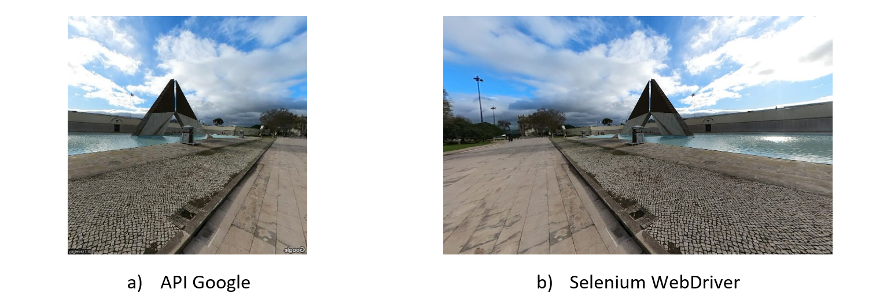
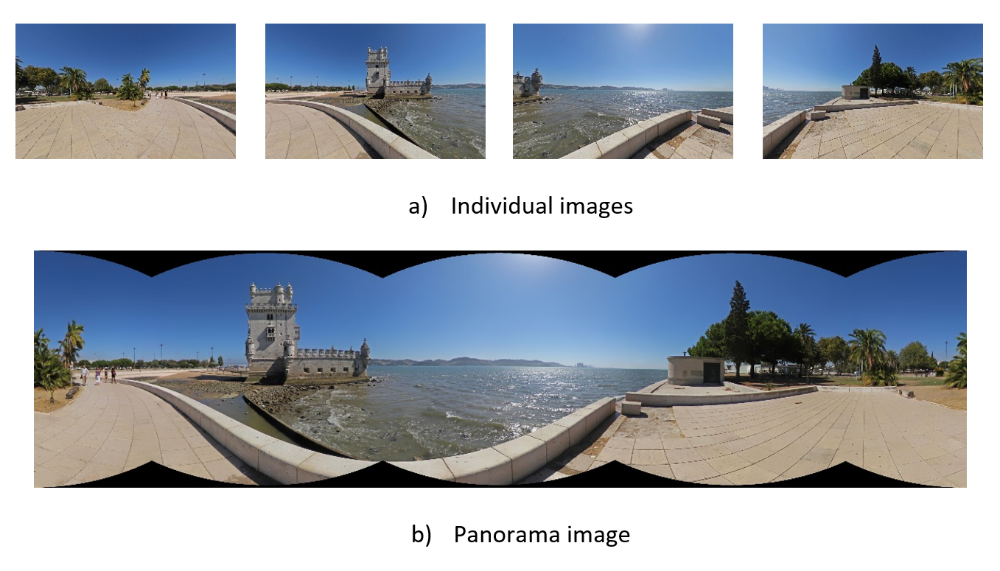

# Google Street View Imagery Extraction Pipeline 
**Current version:** v1.1.0  
**Release date:** March 2026  

USE-SVI (Urban Sampling & Extraction of Street View Imagery) is a Python pipeline that samples road networks at fixed intervals (e.g., every 30 meters), generates Google Street View URLs (0°, 90°, 180°, 270°), automatically downloads images using Selenium without relying on official APIs, stitches images into panoramas, and exports structured outputs (CSV, XLSX) that can be directly imported into GIS environments for further spatial analysis.

The original implementation associated with the published article corresponds to an earlier release of the pipeline. This repository contains the actively maintained and updated version of USE-SVI, including refinements and technical improvements introduced after publication. The core methodological framework remains consistent with the published study. The journal paper can be found [here](https://doi.org/10.1016/j.mex.2026.103785). 

<p align="center">  </p>

The workflow is organised into three sequential scripts:

1. `1_URL.py` – Generates sampling points and Street View URLs.
2. `2_IMAGES.py` – Downloads images and extracts metadata.
3. `3_PANORAMA.py` – Stitches images into panoramas and exports outputs.

Scripts must be executed in this order.

# Requirements
- Python 3.12
- Google Chrome

Install Python dependencies:

```
pip install -r requirements.txt
```

## Input data
The pipeline requires a street network shapefile (.shp) as input. Street network data can be obtained free of charge from the [BBBike platform](https://extract.bbbike.org/).

In the example provided in this repository, the road network of Lisbon is used (`roads_lisbon.shp`). However, the pipeline can be applied to any city for which street network data are available.


# 1. URL generation and metadata logging
The sampling interval (in meters) can be modified by changing the distance value. For each sampling point, four Google Street View URLs are generated, corresponding to the cardinal directions (0°, 90°, 180°, and 270°).

The `generate_image_url()` function constructs these URLs based on geographic coordinates and viewing angles.

For each image, the following metadata are recorded:
- Geographic coordinates (latitude and longitude)
- Viewing angle
- Image name (used to save the file)

The metadata are saved in a CSV file `streetview_urls.csv` located in the `outputs/` folder.

Run this step with:
```
python 1_URL.py --roads roads/roads_lisbon.shp --distance 30
```

# 2. Image acquisition

This step uses Selenium WebDriver (Google Chrome) to automatically access the URLs generated in the previous stage and download the corresponding Street View images.

The script:
- Opens each generated URL
- Captures the image
- Extracts additional metadata (e.g., image capture date, when available)

The metadata are saved in a CSV file `streetview_urls_with_status_data.csv` located in the `outputs/` folder.

<p align="center">  </p>


The parameter `&pitch=0` is automatically appended to ensure a horizontal camera view (0°). This value can be modified if needed.

Run this step with:
```
python 2_IMAGES.py
```


# 3. Panorama creation

This step combines the four images captured at each sampling location into a single panoramic image. The process uses OpenCV to automatically align and merge the images.

<p align="center">  </p>

- The generated panorama is saved in the `panoramas/` folder.
- A metadata Excel file `panoramas_metadata.xlsx` is created in `outputs/`, containing:
  - Latitude
  - Longitude
  - Capture date (when available)
  - Panorama name
  - Number of images stitched

Run this step with:

```
python 3_PANORAMA.py
```


## Paper / Attribution / Citation

If you use USE-SVI, please cite the [paper](https://doi.org/10.1016/j.mex.2026.103785):

Betco, I., Viana, C. M., & Rocha, J. (2026). USE-SVI: A reproducible pipeline for sampling, acquiring, and stitching Street View imagery to support urban analytics. MethodsX, 16, 103785. https://doi.org/10.1016/j.mex.2026.103785


BibTeX:
```
@article{BETCO2026103785,
title = {USE-SVI: A reproducible pipeline for sampling, acquiring, and stitching Street View imagery to support urban analytics},
journal = {MethodsX},
volume = {16},
pages = {103785},
year = {2026},
issn = {2215-0161},
doi = {https://doi.org/10.1016/j.mex.2026.103785},
url = {https://www.sciencedirect.com/science/article/pii/S2215016126000026},
author = {Iuria Betco and Cláudia M. Viana and Jorge Rocha}
}
```
