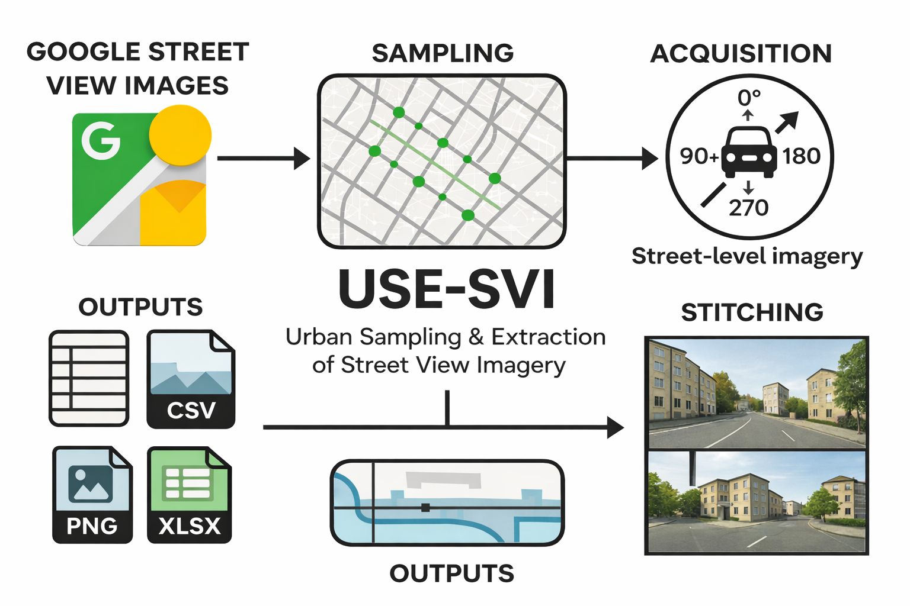

# Street View Imagery Extraction Pipeline

USE-SVI (Urban Sampling & Extraction of Street View Imagery), a reproducible pipeline for sampling, acquiring, and stitching Google Street View images for city-scale analysis.

The protocol ensures regular spatial coverage by generating sampling points at fixed intervals along the street network and captures four viewing directions per location to represent the main visual perspectives. Image acquisition is performed through automated browser-based interaction with the Google Street View web interface using Selenium WebDriver, enabling systematic retrieval of street-level views without relying on official APIs.

The journal paper can be found [here](https://doi.org/10.1016/j.mex.2026.103785) 

