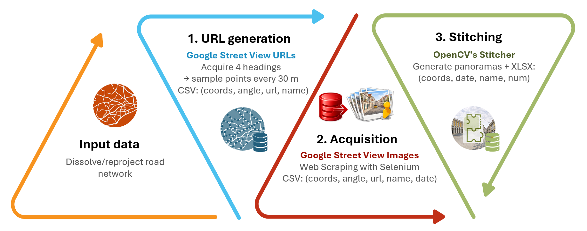
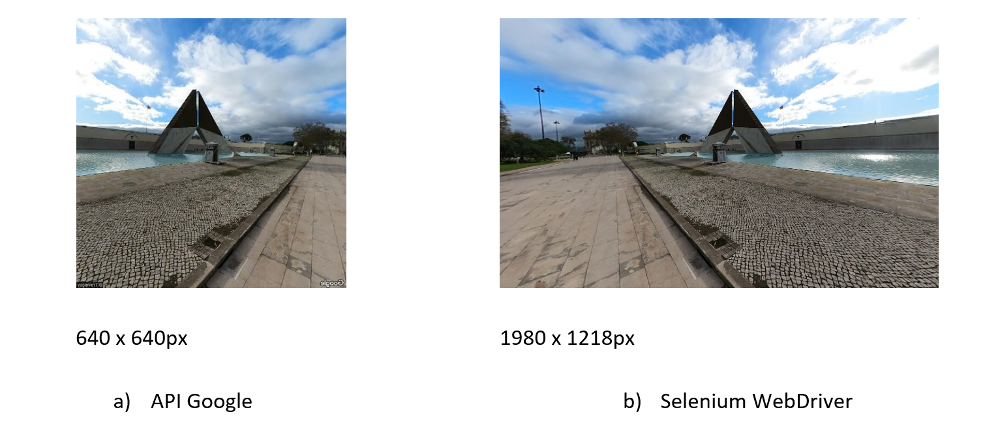

# Google Street View Imagery Extraction Pipeline

USE-SVI (Urban Sampling & Extraction of Street View Imagery), a reproducible pipeline for sampling, acquiring, and stitching Google Street View images for city-scale analysis.

The protocol ensures regular spatial coverage by generating sampling points at fixed intervals along the street network and captures four viewing directions per location to represent the main visual perspectives. Image acquisition is performed through automated browser-based interaction with the Google Street View web interface using Selenium WebDriver, enabling systematic retrieval of street-level views without relying on official APIs.

The journal paper can be found [here](https://doi.org/10.1016/j.mex.2026.103785) 

<p align="center">  </p>

This method aims to collect images from Google Street View using three custom Python scripts that interact directly with Google Street View. To run the code, users need to install Python 3.12 and Chrome. The image collection and processing were carried out in several stages:

<p align="center">  </p>

# Requirements

Install Python 3.12 and Chrome

To install the requirements for the application (i.e., geopandas, pandas, shapely, geopy, selenium, selenium-stealth, webdriver-manager, opencv-python), run the following code on the command line:

```
pip install -r requirements.txt
```

# Input data

To generate Google Street View URLs, the pipeline requires a street network shapefile as input. Street network data can be obtained free of charge from the  [BBBike platform](https://extract.bbbike.org/).

In the example provided with this repository, the road network of the city of Lisbon is used `roads_lisbon.shp`, but the pipeline can be applied to any city for which street network data are available.


# 1. URL generation and metadata logging

For each point, four Google Street View URLs were created, corresponding to the cardinal directions 0°, 90°, 180° and 270°, thus providing comprehensive visual coverage of the surrounding urban area. The `generate_image_url()` function constructs these URLs based on geographic coordinates and viewing angles. Information associated with each image - namely geographic coordinates, viewing angle, and the image’s unique identifier was recorded in a .csv file located in the folder `outputs`. 

The previous steps can be achieved by running:

```
 python 1_URL.py
```


# 2. Image acquisition

To automate the collection of Google Street View images, the Selenium library was utilised. The script developed automatically accesses the URLs generated in the previous stage, downloads the relevant images, and extracts additional information such as the image capture date (when available). 

<strong>Accessing URLs and capturing images:</strong> The script employs Selenium WebDriver, which manages a web browser (specifically, Google Chrome) to access the previously generated Google Street View URLs. The parameter `&pitch=0` is automatically appended to set the camera pitch to 0 degrees; this value can be adjusted if a different camera inclination is desired. 

<strong>Use of Stealth Techniques:</strong> To prevent the script from being blocked by Google's bot detection systems, the stealth technique is applied using the selenium_stealth library. This technique masks browser and system characteristics to simulate more human behavior, such as language selection and browser settings. This method allows you to overcome the limitations of Google API requests and issues related to payment declines, as well as overcome limitations associated with the quality of images downloaded via the API.

<p align="center">  </p>

To proceed with the image acquisition, use the script:

```
 python 2_IMAGES.py
```

# 3. Panorama creation

Panorama creation involves combining multiple images taken at specific locations in Lisbon, using geographic coordinates, into a single panoramic picture. This process is automated through a script that employs the OpenCV library to align and merge the images, resulting in the final panorama.

<p align="center">  </p>

<strong>Panorama storage:</strong> The generated panorama is saved to a specified folder with a sequential file name. The file path of the panorama is recorded in an Excel file, which also contains metadata such as latitude, longitude, image name, date, and panorama file name.


To proceed with panorama creation, run the script:

```
 python 3_PANORAMA.py
```

## Paper / Attribution / Citation

If you use USE-SVI, please cite the [paper](https://doi.org/10.1016/j.mex.2026.103785):

Betco, I., Viana, C. M., & Rocha, J. (2026). USE-SVI: A reproducible pipeline for sampling, acquiring, and stitching Street View imagery to support urban analytics. MethodsX, 16, 103785. https://doi.org/10.1016/j.mex.2026.103785


BibTeX:
```
@article{BETCO2026103785,
title = {USE-SVI: A reproducible pipeline for sampling, acquiring, and stitching Street View imagery to support urban analytics},
journal = {MethodsX},
volume = {16},
pages = {103785},
year = {2026},
issn = {2215-0161},
doi = {https://doi.org/10.1016/j.mex.2026.103785},
url = {https://www.sciencedirect.com/science/article/pii/S2215016126000026},
author = {Iuria Betco and Cláudia M. Viana and Jorge Rocha}
}
```
